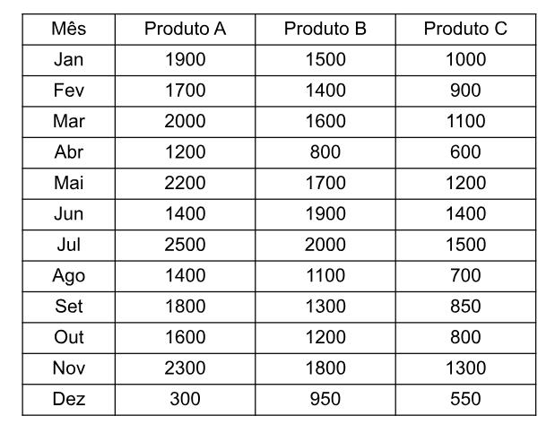

### Exercício 1 — Operador \* com matriz

Crie a matriz vendas.

- Multiplique a venda da Loja A em Janeiro por 2.

- Multiplique a venda da Loja C em Abril por 3.

- Guarde os resultados em variáveis.

### Exercício 2 — If

Usando a mesma matriz vendas:

Verifique a venda da Loja C em Abril.

Se o valor for maior que 200, mostre: Meta Ultrapassada

### Exercício 3 — If...Else

Verifique a venda da Loja B em Fevereiro.

Se o valor for maior ou igual a 150:

Boa venda.

Caso contrário:

Venda abaixo da meta.

### Exercício 4 — If...Else If...Else

Utilize a venda da Loja A em Março.

Faça:

- maior ou igual a 170 → Excelente

- maior ou igual a 140 → Boa

- caso contrário → Regular

### Exercício 5 — Data Frame (Funcionarios)

Utilize a tabela funcionarios.

Verifique o salário do Gerente na Faixa III.

Se o salário for maior ou igual a R$ 7.000, mostre:
Cargo com salário elevado.

Caso contrário, mostre:
Cargo com salário abaixo da faixa esperada.

### Exercício 6 — Operador \* com Data Frame 

Utilize a tabela funcionarios.

Verifique o salário do Diretor criativo na Faixa IV.

Classifique o salário da seguinte forma:

Se o salário for maior ou igual a R$ 15.000, mostre:
Salário de nível executivo.
Se o salário for maior ou igual a R$ 10.000, mostre:
Salário de alta gestão.
Caso contrário, mostre:
Salário abaixo da alta gestão.

### Exercício 7 — If com Calculo 

Utilize a tabela funcionarios.

Verifique o salário do cargo Analista I na Faixa V.

Se o salário for maior ou igual a R$ 10.000, mostre:
Salário de alta progressão.
Caso contrário, mostre:
Salário abaixo da alta progressão.
