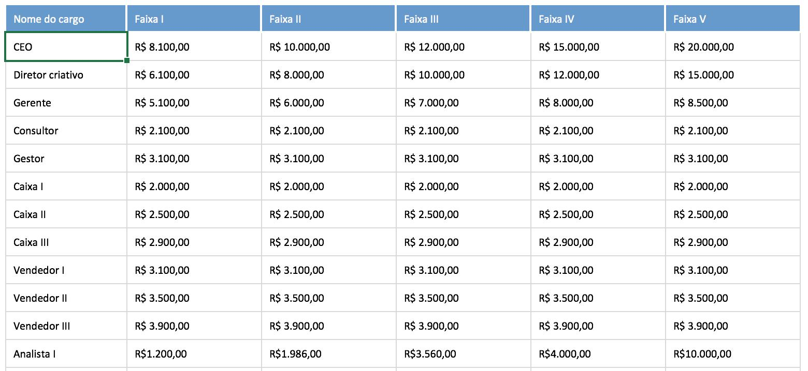

### Exercício 1 — Operador \* com matriz

Crie a matriz vendas.

- Multiplique a venda da Loja A em Janeiro por 2.

- Multiplique a venda da Loja C em Abril por 3.

- Guarde os resultados em variáveis.

### Exercício 2 — If

Usando a mesma matriz vendas:

Verifique a venda da Loja C em Abril.

Se o valor for maior que 200, mostre:

### Exercício 3 — If...Else

Verifique a venda da Loja B em Fevereiro.

Se o valor for maior ou igual a 150:

Boa venda.

Caso contrário:

Venda abaixo da meta.

### Exercício 4 — If...Else If...Else

Utilize a venda da Loja A em Março.

Faça:

- maior ou igual a 170 → Excelente

- maior ou igual a 140 → Boa

- caso contrário → Regular

### Exercício 5 — Data Frame (Funcionarios)

Verifique o salário da Ana.

Se for maior que 8000, mostre:

Salário elevado.

Caso contrário:

Salário comum.

### Exercício 6 — Operador \* com Data Frame 

Utilize o salário do Lucas.

Calcule quanto ele receberia em 12 meses usando o operador \*.

Mostre o resultado.

### Exercício 7 — If com Calculo 

Usando o resultado do exercício anterior:

Se o salário anual do Lucas for maior que 50000, mostre:

Renda anual acima de 50 mil.

Caso contrário:

Renda anual abaixo de 50 mil.
